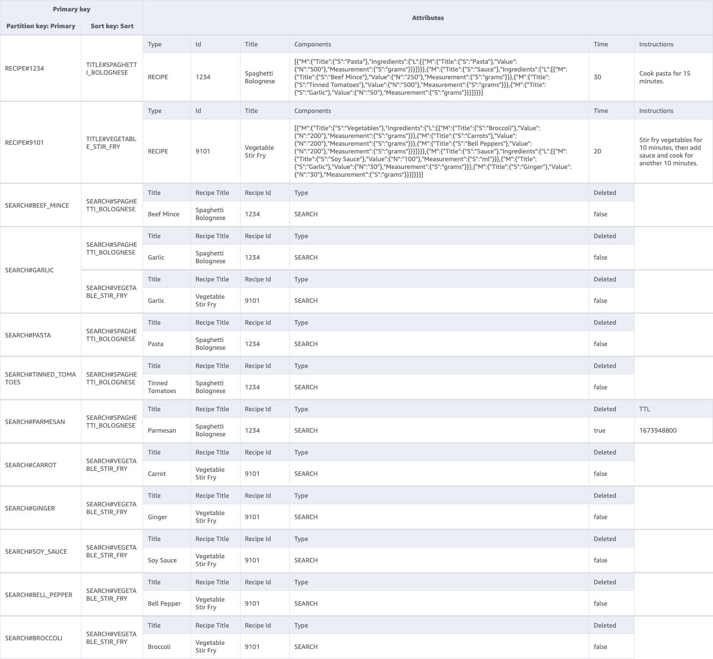

# Skran Visitor BFF

REST API serving the Skran visitor front end with recipe data and search results by recipe ingredient.

## Behaviour

Enables the following actions for Visitors to Skran.

- Look at a recipe in detail
- Search for recipes by one or more ingredients
- Search for recipes by title
- Filter recipes by cuisine

## Entity Relationship


## Table Design

| Primary           | Sort                       | type   | attributes                               |
|-------------------|----------------------------|--------|------------------------------------------|
| RECIPE#1234       | TITLE#SPAGHETTI_BOLOGNESE  | RECIPE | [Recipe Attributes](src/api/models.go) |
| SEARCH#BEEF_MINCE | Beef Mince                 | SEARCH | [Search Attributes](src/api/models.go) |



## Build

### CSS

```bash
curl -sLO https://github.com/tailwindlabs/tailwindcss/releases/latest/download/tailwindcss-macos-x64
chmod +x tailwindcss-macos-x64
mv tailwindcss-macos-x64 tailwindcss
./tailwindcss -i index.css -o public/index.css --minify 
```

### JS

```bash
curl -sLO https://unpkg.com/htmx.org@1.9.10/dist/htmx.min.js
mv htmx.min.js public/htmx.min.js
```
## Local Development

SAM local is used to run the API locally.
```bash
sam sso login --profile sso-dev
```

```bash
sam local start-api --profile sso-dev
```

S3 buckets can be updated with the following command.

```bash
aws s3 cp ./templates s3://skran-app-ssr-templates --profile sso-dev --recursive
```

```bash
aws s3 cp ./public s3://skran-app-ssr-assets --profile sso-dev --recursive
```